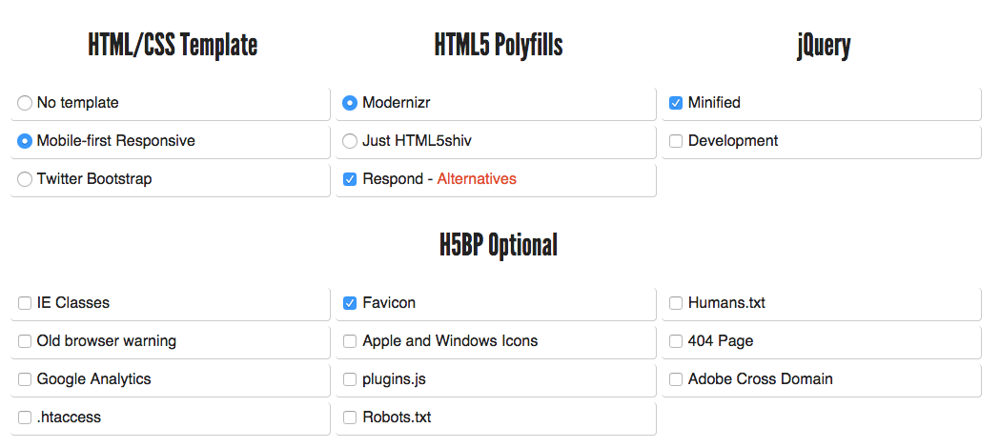

There is no in-class meeting today, but you should read the notes below and be sure to do the activities.  I have an assignment that is due on Tuesday that builds on what you read in the [last lesson](/lesson-05) plus the information below.


### Using Media Queries for Responsive Design

Media Queries are a feature in CSS that allow you to specify when a certain rule (or set of rules) will be applied.

```
// normal style
#header-image {
    background-repeat: no-repeat;
    background-image:url('image.gif');
}

// show a larger image when you're on a big screen
@media screen and (min-width: 1200px) {
    #header-image {
        background-image:url('large-image.gif');
    }
}

// remove header image when printing.
@media print {
    #header-image {
        display: none;
    }
}
```

Media queries start with `@media`, followed by a condition or set of conditions.  When the condition (or conditions) are true, the CSS inside of the media query will be triggered to apply.

The condition line ends with a {, and CSS rules are written (as usual) after the open curly brace.  Don't forget to close the curly brace!  You will end up with two closed curly braces } at the end of your media query - one for the last CSS rule, and one for the media query itself.

There are more conditions than I can list here, but if you are interested you can read more about the options on [Mozilla's guide to media queries](https://developer.mozilla.org/en-US/docs/Web/Guide/CSS/Media_queries) (Mozilla has a great CSS resource guide in general!).

The basic conditions you will see are:

#### Media Types

There are more than 10 media types, but the most commonly used ones are : 

```
screen (media type, generally refers to things 
        viewed on a screen, including mobile devices)
   
print (media type, generally refers to printed documents.  
      This is how your page will look when printed!)
   
all (all of the media types combined - use this to apply 
     to both screen and print!)
```

#### Measurements

Measurements allow you to get the width of the window (or the screen, if the window takes up the whole viewport, like on a phone).  Measurements can be done using any of the valid web measurements - most commonly pixels (px), but could be em or rem.

```
min-width
max-width
```

#### Logical Operators in Media Queries

Conditions in media queries can be combined using logical operators.  There are three different logical operators available for use within media queries, including `and`, `not`, and `only`.


### HTML5 Boilerplate

**HTML5 Boilerplate** is 'the web's most popular front-end template'.  Using HTML5BP to start web projects can give you a quick starting point and a base on which to build valid websites.

[HTML5 Boilerplate](https://html5boilerplate.com/)

You can download HTML5BP directly from this website, but I like to create a custom build using the [Initializr tool](http://www.initializr.com/) (linked from the main HTML5BP site).

Visit the [Initializr tool](http://www.initializr.com/), then choose the following settings (you can choose different ones for other projects or to experiment, but for right now use the settings I have selected).



You will want to unzip this into a **new folder** in your **document root**.  You can call this folder **boilerplate**.

### Assignment (Due Tuesday, February 9)

- Explore the HTML5 Boilerplate template you have downloaded
  
  - Change the color scheme
  - Change the text
  - Add a logo instead of the text
  - Add Google Web Fonts

- Experiment with the provided media queries

  - can you change the header color when the browser is over 700px?

Once you have had a chance to experiment with HTML5BP, **use what you have created to complete the following**.

- Create a three-page website
- Your website should have a homepage and two sub-pages
- Your **sidebar** (`<aside>`) should include your **Name** and a short "About Me" (try to get it under 140 characters - think along the lines of a twitter bio, like [@saintjosephs](https://twitter.com/saintjosephs) *"The official account of SJU, Philadelphia's Jesuit University. Founded in 1851. live greater. that's the magis."*).  If you want to include an image, feel free to do so.
- Your **menu** should link to your homepage and to the two sub-pages
- Your homepage should include an image (check out [Unsplash](https://unsplash.com/) for some great imagery.  *Be sure to properly cite your image!*
- Your two pages should include your responses to two [UX Myths](http://uxmyths.com/).  Read at least the titles of each one.  Choose two and write a 150-300 word response for each one.  My suggestions are below, but you can choose whatever you would like.

  - [Myth #4: Design is about making a website look good](http://uxmyths.com/post/654070104/myth-design-is-about-making-a-website-look-good)
  - [Myth #9: Design has to be original](http://uxmyths.com/post/712377283/myth-9-design-has-to-be-original)
  - [Myth #17: The homepage is your most important page](http://uxmyths.com/post/717779908/myth-the-homepage-is-your-most-important-page)
  - [Myth #19: You don’t need the content to design a website](http://uxmyths.com/post/718187422/myth-you-dont-need-the-content-to-design-a-website)
  - [Myth #28: White space is wasted space](http://uxmyths.com/post/2059998441/myth-28-white-space-is-wasted-space)
    


### Readings (read these for February 9th as well)

Check out the [9 basic principles of responsive web design](http://blog.froont.com/9-basic-principles-of-responsive-web-design/) - this is short and has lots of graphics.  Do you recognize some of these responsive design patterns?  You should be familiar with the difference between **Relative and Static units**, have a familiarity with **what breakpoints are**, and have a concept of what adding a wrapper with a **max width** will do to your content.

Read the following from Lesson 15 & 22 in Hack Design.  These readings will help you to recognize mobile design patterns, and help you review what we learned in today's class.

- [Responsive Web Design by Ethan Marcotte](http://alistapart.com/article/responsive-web-design) (I know, you've read it before!  Just wanted to remind you it exists.  Do you understand anything about this article more now than you did before?  How has your understanding of this topic changed?)
- [Responsive Navigation Patterns](http://bradfrost.com/blog/web/responsive-nav-patterns/)
- [Multi-Device Layout Patterns](http://www.lukew.com/ff/entry.asp?1514)
- [Mobile Patterns](http://www.mobile-patterns.com/)

**If you're interested**, look into the [User Experience lessons](https://hackdesign.org/lessons/9), [Defining & Expanding User Experience](https://hackdesign.org/lessons/11), and [Understanding the User in User Experience](https://hackdesign.org/lessons/12).  User Experience is a huge area of web and interaction design, and salaries for UX experts are quite high.

## Resources

- [A really good tutorial on CSS and Responsive Web Design](http://learn.shayhowe.com/advanced-html-css/responsive-web-design/#media-queries)
- [CSS Tricks - CSS Media Queries & Using Available Space](http://css-tricks.com/css-media-queries/)
- [CSS Tricks - Media Queries for Standard Devices](http://css-tricks.com/snippets/css/media-queries-for-standard-devices/)

### Some Responsive Examples

- [Marcotte's Example](http://alistapart.com/d/responsive-web-design/ex/ex-site-FINAL.html)
- [Lots of examples at Mediaqueri.es](http://mediaqueri.es/)

### More about HTML5 Boilerplate

- [Sitepoint's HTML5BP Introduction](http://www.sitepoint.com/introduction-html5-boilerplate/)
- [HTML5BP in Simple Terms](http://ningbit.github.io/blog/2013/09/30/html5-boilerplate-explained-in-simple-terms/)